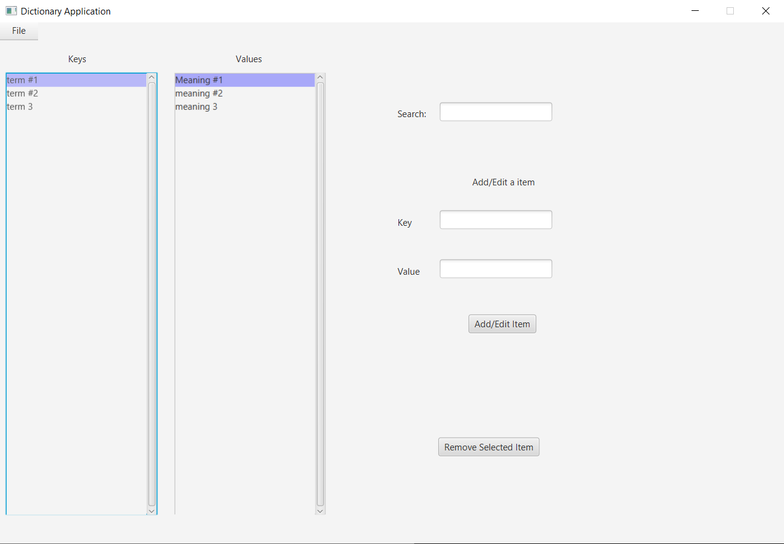

# Dictionary JavaFX
A dictionary application I created for a Uni assignment

You can add terms, edit their meaning, and delete terms.
You can also save your dictionary or load a dictionary (The save/load is being implemented with ObjectInputStream and ObjectOutPutStream) 
